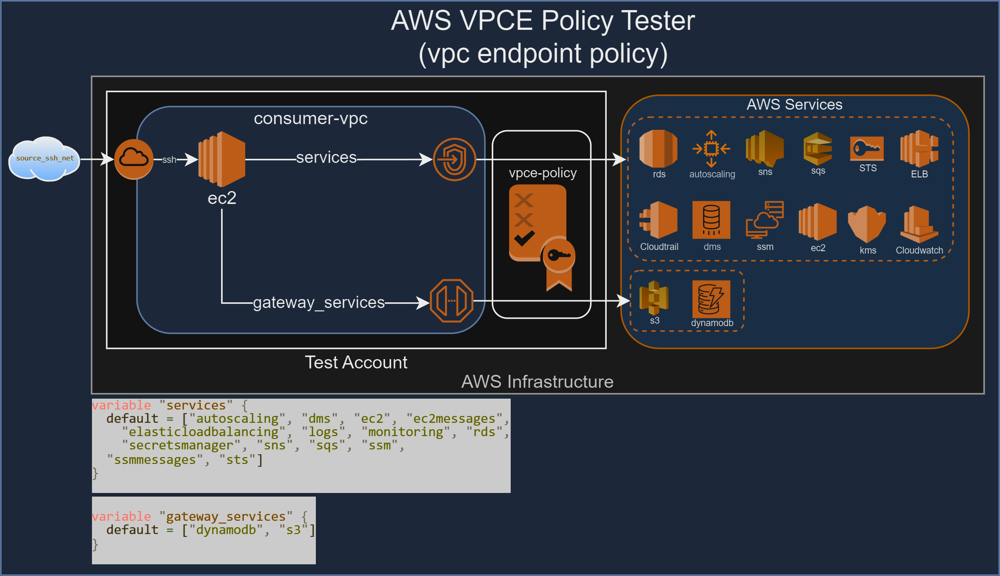

# AWS-VPCE-Policy-Tester
- [Overview](#overview)
  - [Key Features](#key-features)
  - [Project Structure](#project-structure)
  - [Important Notes](#important-notes)
  - [Considerations](#considerations)
  - [Prerequisites](#prerequisites)
  - [Installation](#installation)
  - [Usage](#usage)
  - [TO DO](#to-do)
  - [Contributing](#contributing)
  - [Disclaimer](#disclaimer)
  - [License](#license)



This repository contains Terraform configuration files and various scripts for setting up a test environment to test vpc endpoint policy with privatelink services.

# Overview

I haven't previously tested VPC endpoint policies in depth, but I understand their importance in controlling access to AWS services and mitigating risks. My goal was to deepen my knowledge of AWS services that I'm familiar with, specifically focusing on creating restrictive policies to reduce the attack surface within a secure environment. This process is challenging due to the varying requirements of different APIs. This repository was built to bridge the gap in my understanding and generate outputs to effectively test allow and deny controls in VPC endpoint policies.

## Key Features
- Tests multiple AWS services against VPC endpoint policies
- Identifies allowed and denied actions for each service
- Supports different policy configurations (PrincipalOrgID, PrincipalAccount, PrincipalOrgPaths, ResourceRestriction, DenyAll)
- Loads an AWS CLI command database for testing each service
- Generates detailed logs of test results
- Creates CSV reports for easy analysis
- Minimal resource creation required for testing
- Helps identify unintended policy denies
- Assists in building and refining VPC endpoint policies
- Provides insights into API-specific behavior with VPC endpoint policies

## Project Structure
```
aws-vpce-policy-tester/
├── img/
├── scripts/
│   ├── aws_vpce_policy_tester.py # Script that performs test
│   ├── aws_commands.json         # AWS Command Database
├── tpl/
│   ├── test_ec2.tpl              # Terraform template files used for ec2 metadata startup.
├── ec2.tf                        # Terraform configuration file for defining EC2 instances and related resources.
├── iam.tf                        # Terraform configuration file for defining IAM roles, policies, and profiles.
├── vpce.tf                       # Terraform configuration file for defining AWS PrivateLink endpoints and related resources.
├── sg.tf                         # Terraform configuration file for defining security groups and their rules.
├── variables.tf                  # Terraform configuration file for defining variable declarations.
├── vpc.tf                        # Terraform configuration file for defining VPC, subnets, and related networking resources.
├── README.md                     # Markdown file for documenting the project, including descriptions of files and usage.
```

## Important Notes
- Commands are in some cases invalid. 
    - We can tell that the commands are first denied in option5, but then allowed in other options even though the command fails.
    - This doesn't necessarily mean each specific aws command will work through the endpoint.
- The ec2 instance IAM policy is intentionally overly permissive. This project focuses on testing VPC endpoint IAM policy, not resource-based IAM policy.
- The primary function of VPC endpoint policy is to control access to specific AWS services within your VPC.
    - This effectively sets a perimeter for connectivity to AWS services within your vpc. 
    - Access to organizations, ou-paths, and specific resources can be used to create least privilege perimeter access to aws services. 
    - This can help mitigate unauthorized data movement and security control bypass issues like the ssm tunnel proxy.
- IAM policies should be used to apply fine-grained access controls at the principal level, while VPC endpoint policies provide an additional layer of network-level access control. 
    - Together, they mitigate risks related to unauthorized permissions and network access.
- Each AWS service functions differently, so it's important to test your required functionality against desired vpc-endpoint policy state. 
    - Some service APIs appear to be at an org level, so resource-defined policy may not work for most commands.
    - Some services and specific actions have higher elevated risk of exfil/infil.

## Considerations
- This is as far as I am in my learning journey, hopefully this helps yours and I appreciate any feedback.
- This repo doesn't discuss all security concepts or provide an end-to-end solution.
- AWS IAM policy has character count limitations and may not scale well for large vpcs.
- More tests are needed, such as working scenarios of cross-account access and commands that succeed fully.
- Take these results with a grain of salt and do your own thorough testing with your own test cases.
- Im still working on getting some commands to work in the #to-do section.
- **DO NOT RUN THIS IN A PRODUCTION ENVIRONMENT**

## Prerequisites

1. An AWS account
2. AWS CLI installed and configured
3. Terraform installed
4. Git installed
5. An ssh/scp client (to login/export results)

## Installation

1. Clone the repository:
   ```powershell
   git clone https://github.com/drewpnutz/aws-vpc-endpoint-policy-tester.git
   cd aws-vpc-endpoint-policy-tester
   ```

2. Select which option you want to test in variables.tf
variables.tf
   ```sh
   variable "option" {
        type        = number
        description = "Set this to 1 (PrincipalOrgID), 2 (PrincipalAccount), 3 (ResourceRestriction), 4 (OU-Path) or 5 (Deny All)"
        default     = 5
        }
    ```

3. Generate an ssh key and store the public key in your environment variables (below)


4. Set up your AWS credentials:

   ```powershell
   $env:AWS_ACCESS_KEY_ID="your_access_key"
   $env:AWS_SECRET_ACCESS_KEY="your_secret_key"
   $env:TF_VAR_org_id="your_org_id"
   $env:TF_VAR_org_path="your_org_path"
   $env:TF_VAR_account_id="your_account_id"
   $env:TF_VAR_source_ssh_net="your_ssh_ip"
   $env:TF_VAR_public_key="your_public_ssh_key"
   ```

   ```sh
   export AWS_ACCESS_KEY_ID="your_access_key"
   export AWS_SECRET_ACCESS_KEY="your_secret_key"
   export TF_VAR_org_id="your_org_id"
   export TF_VAR_org_path="your_org_path"
   export TF_VAR_account_id="your_account_id"
   export TF_VAR_source_ssh_net="your_ssh_ip"
   export TF_VAR_public_key="your_public_ssh_key"
   ```

5. Run Terraform:
   ```powershell
   terraform init
   terraform apply
   ```

## Usage

 - Give IAM policy creation about 10-15 minutes afterwards to settle before testing to ensure accuracy. 
 - After resources are created, ssh into your instace via the provided output for the elastic IP. 
 - Make sure to SSH using your public key you created earlier. 
 - Once you are logged in, you can run the VPC Endpoint Policy Tester using:

```bash
python aws_vpce_policy_tester.py [OPTIONS]
```

For available options, run:

```bash
python aws_vpce_policy_tester.py --help
    Usage: python aws-vpce-policy-tester.py [OPTIONS]

    Options:
    --log          Generate a full log file with $day/hour/minute-log.txt.
    --report       Generate a CSV report with $day/hour/minute-report.csv (command, verdict, option description).
    --both         Generate both log and report files.
    --shell        Output only to the shell without writing any files.
    
    Examples:
    python aws-vpce-policy-tester.py --log
    python aws-vpce-policy-tester.py --report
    python aws-vpce-policy-tester.py --both
    python aws-vpce-policy-tester.py --shell
```

## TO DO:
 - fix resource create/delete
 - auto-run after 15 minutes of startup
 - investigate weird tpl interpolation of policy. 
 - ReadMe
 - create s3 private endpoint testing
 - generate report output in s3
 - create resources to complete commands

### Issues with these commands working in deny tests
    ```
    monitoring
        "aws cloudwatch list-tags-for-resource --resource-arn bogus-resource-arn", // Requires building cloudwatch resources?
        // "aws cloudwatch get-metric-data --metric-data-queries bogus-query" // Requires building cloudwatch resources?
    logs
        // "aws logs list-tags-for-resource --resource-arn bogus-log-arn", // Requires building cloudtrail resources?
    rds
        // "aws rds list-tags-for-resource --resource-name bogus-db-instance", 
    s3
        // "aws s3 rb s3://bogus-bucket", remove_bucket failed: s3://test An error occurred (AccessDenied) when calling the DeleteBucket operation: Access Denied
        // "aws s3api get-object --bucket bogus-bucket --key bogus-key /tmp/bogus-file",
        // "aws s3api put-object --bucket bogus-bucket --key bogus-key --body /tmp/bogus-file"
    sts
        // "aws sts assume-role --role-arn arn:aws:iam::VAR_ACCOUNT_ID:role/test_assume_role --role-session-name test-session" 
    ```

### These commands are working, but the delete commands aren't. 
    ```
    "aws autoscaling create-auto-scaling-group --auto-scaling-group-name bogus-asg --launch-configuration-name invalid-config --min-size 1 --max-size 1"
    "aws autoscaling create-auto-scaling-group --auto-scaling-group-name bogus-asg --launch-configuration-name --invalid-config foo ",
    "aws dms create-endpoint --endpoint-identifier bogus-endpoint --invalid-config foo", 
    "aws secretsmanager create-secret --name bogus-secret --secret-string bogus-string --invalid-config foo",
    ```

## Contributing

Feel free to submit issues, create pull requests, or fork the repository to help improve the project.

## Disclaimer

This project is for testing and educational purposes only. The author is not responsible for any misuse or damage caused by this tool. Use at your own risk and always test in a safe, non-production environment.

## License

[MIT License](LICENSE)