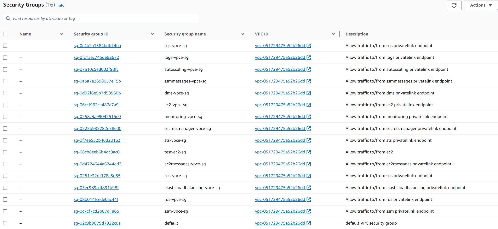
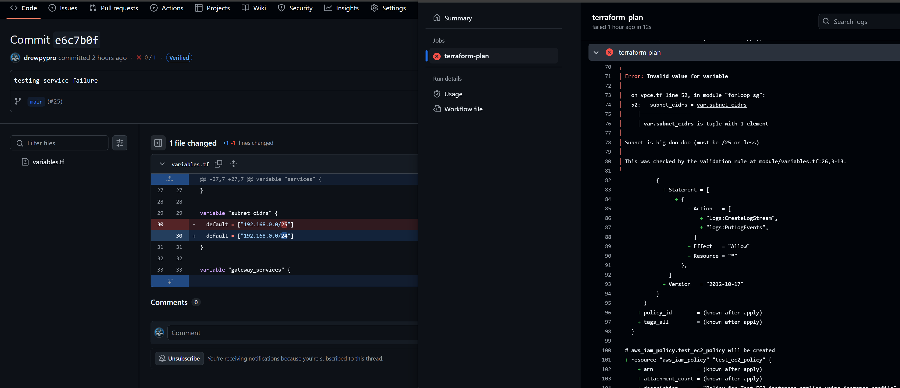

# SG per VPC Endpoint

# Custom Rules per Service

# Subnet Validation

- The Terraform plan failed in [run#49](https://github.com/drewpypro/aws-vpce-policy-tester/actions/runs/11849375127/job/33022510919) due to an overly permissive subnet variable introduced in [this commit](https://github.com/drewpypro/aws-vpce-policy-tester/commit/e6c7b0fd80caa5f3d6acf2997b636df361d32cc2).

# Service Validation

- The Terraform plan failed in [run#50](https://github.com/drewpypro/aws-vpce-policy-tester/actions/runs/11850248957/job/33024832642) due to an unauthorized service being supplied to the module introduced in [this commit](https://github.com/drewpypro/aws-vpce-policy-tester/commit/7c472d76f1404911fbc2a11b6acbcc6c325f4e03).