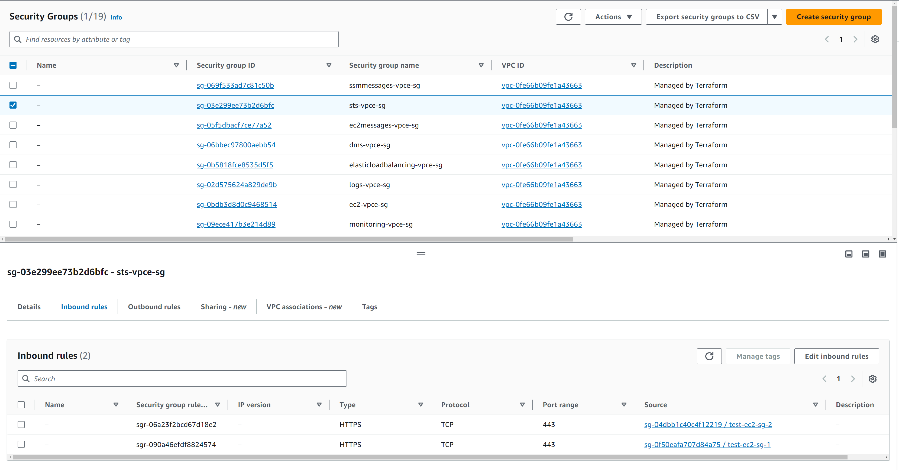
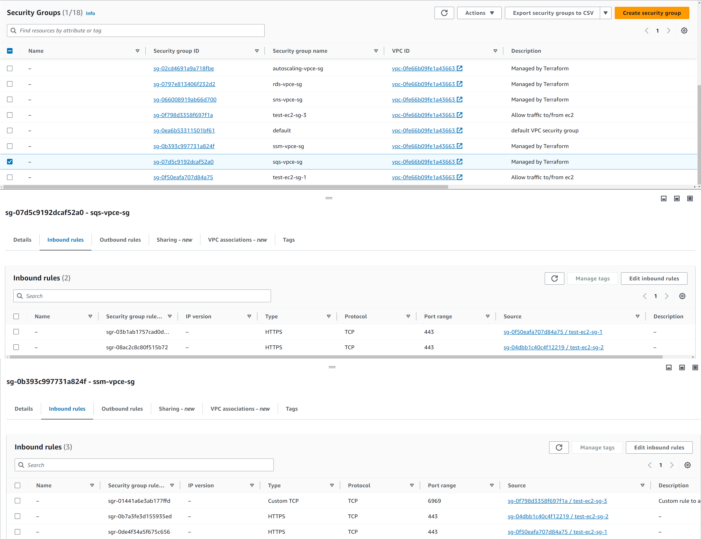

# [SG per VPC Endpoint](https://github.com/drewpypro/aws-vpce-policy-tester/blob/b162b4bf4f3f611c103794d7f4a4e29470a6a283/module/sg.tf#L1)

# [Custom Rules per Service](https://github.com/drewpypro/aws-vpce-policy-tester/blob/b162b4bf4f3f611c103794d7f4a4e29470a6a283/module/sg.tf#L15)

 